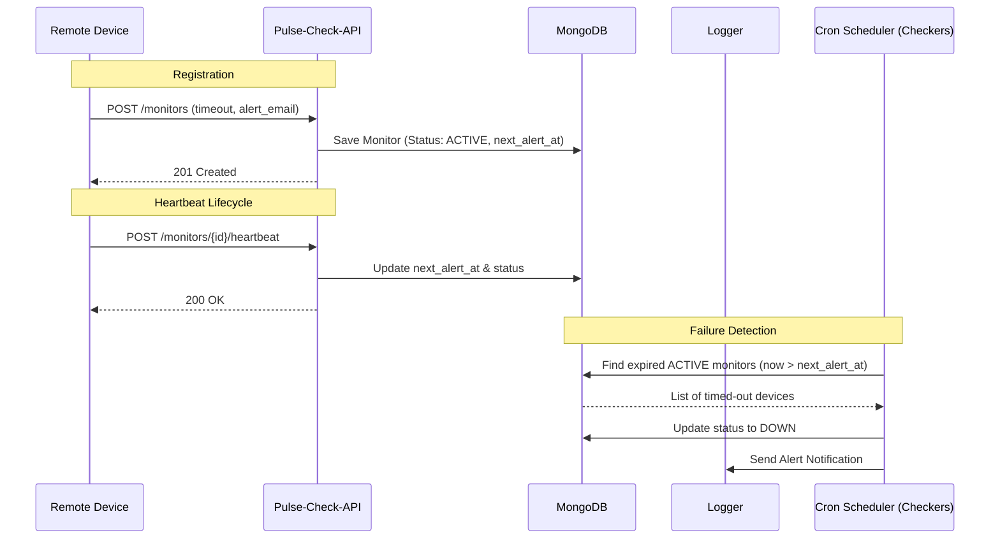

# Pulse-Check-API ("Watchdog" Sentinel)

Pulse-Check-API is a robust "Dead Man's Switch" monitoring service designed for critical infrastructure. It allows remote devices to register monitors with specific heartbeating intervals. If a device fails to check in within its allocated time, the system automatically triggers alerts.

## Architecture Diagram

The following sequence diagram illustrates the core lifecycle of a monitor: registration, heartbeating, and the automated alert system.



---

## Setup Instructions

Follow these steps to get the Pulse-Check-API running locally.

### Prerequisites
- [Node.js](https://nodejs.org/) (v18 or higher)
- [MongoDB](https://www.mongodb.com/try/download/community) (running locally or a connection string)

### 1. Clone the Repository
```bash
git clone <your-repo-link>
cd Pulse-Check-API
```

### 2. Install Dependencies
```bash
npm install
```

### 3. Configure Environment Variables
Create a `.env` file in the root directory and add the following variables:
```env
PORT=3000
MONGODB_URI=your-mongodb-uri
```

### 4. Start the Application
```bash
# Development mode
npm run start:dev

# Production mode
npm run start:prod
```

---

## API Documentation

### 1. Register a Monitor
Create a new monitor for a device.
- **Endpoint:** `POST /monitors`
- **Body:**
  ```json
  {
    "id": "solar-farm-01",
    "timeout": 60,
    "alert_email": "admin@example.com"
  }
  ```
- **Responses:**
    - **`201 Created`**: Monitor registered successfully.
      ```json
      {
        "message": "Monitor created successfully",
        "data": {
          "id": "solar-farm-01",
          "timeout": 60,
          "alert_email": "admin@example.com",
          "status": "active"
        }
      }
      ```
    - **`400 Bad Request`**: Validation error (e.g., invalid email or missing fields).
    - **`409 Conflict`**: Monitor ID already exists.

### 2. Send Heartbeat
Reset the countdown timer for a monitor.
- **Endpoint:** `POST /monitors/{id}/heartbeat`
- **Responses:**
    - **`200 OK`**: Heartbeat received and timer reset.
      ```json
      { "message": "Heartbeat received" }
      ```
    - **`404 Not Found`**: Monitor ID not found.

### 3. Pause Monitor
Stop monitoring for a device (e.g., during maintenance).
- **Endpoint:** `POST /monitors/{id}/pause`
- **Responses:**
    - **`200 OK`**: Monitoring paused.
      ```json
      { "message": "Monitor paused" }
      ```
    - **`404 Not Found`**: Monitor ID not found.

### 4. Update Timeout
Dynamically update the timeout duration for an existing monitor.
- **Endpoint:** `PATCH /monitors/{id}/update-timeout`
- **Body:**
  ```json
  { "timeout": 120 }
  ```
- **Responses:**
    - **`200 OK`**: Timeout updated successfully.
      ```json
      { "message": "Monitor timeout updated" }
      ```
    - **`400 Bad Request`**: Validation error (e.g., non-integer timeout).
    - **`404 Not Found`**: Monitor ID not found.

---

## The Developer's Choice: Update Timeout Feature

### The Addition: `PATCH /monitors/{id}/update-timeout`

**Why I added it:**
In a real-world scenario, the operational profile of a monitored device may change over time. For example:
- A weather station might transition from "High Frequency" (60s pings) during a storm to "Low Power" (1-hour pings) during clear weather.
- A server might need a longer timeout window during heavy processing tasks to avoid false offline alerts.

By adding the **Update Timeout** endpoint, I've made the system more robust and flexible. Device administrators can now adjust monitoring sensitivity on-the-fly without having to delete and re-recreate the monitor, ensuring continuous coverage while adapting to changing conditions.

**Implementation Details:**
- **Endpoint:** `PATCH /monitors/{id}/update-timeout`
- **Logic:** Updates the `timeout` value in the database and immediately recalculates the `next_alert_at` timestamp based on the last known heartbeat, preventing unexpected alerts immediately after a change.
